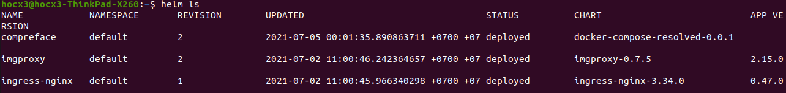
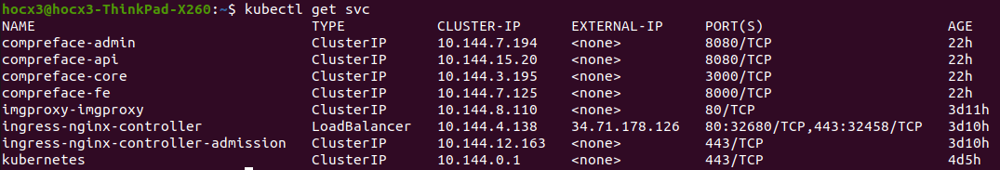
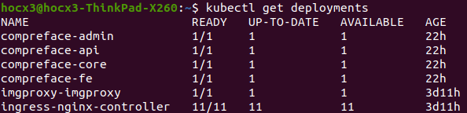
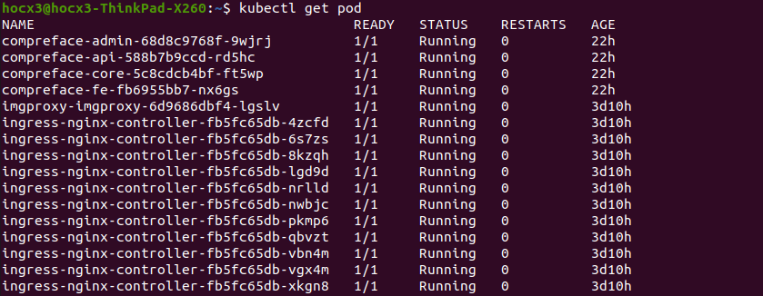

## Problems
- Helm helps you manage Kubernetes applications.
- Helm Charts help you define, install, and upgrade applications.
## Set up local environment
- Install kubectl https://kubernetes.io/docs/tasks/tools/
- Install helm https://helm.sh/docs/intro/install/
- Install gcloud https://cloud.google.com/sdk/docs/install
- Get GKE credentials 
```
gcloud auth login
gcloud config set project face-finder-318218
gcloud container clusters get-credentials tf-main --zone=us-central1
```

- Use helm to manage all releases on GKE
```
helm ls
```

- Use kubectl to manage resources on GKE
  - Services
  
  - Deployments
  
  - Pods
  

## What we have
1. Compreface Service
2. face-finder-api